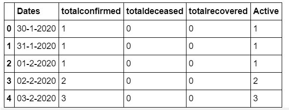
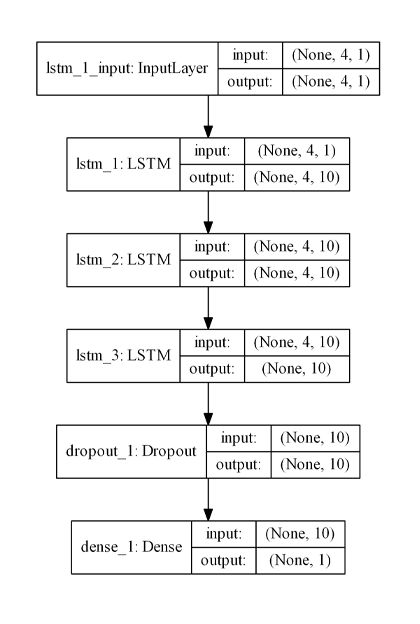
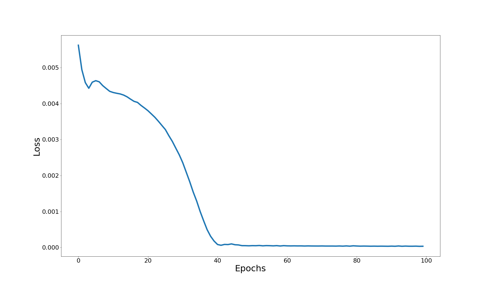
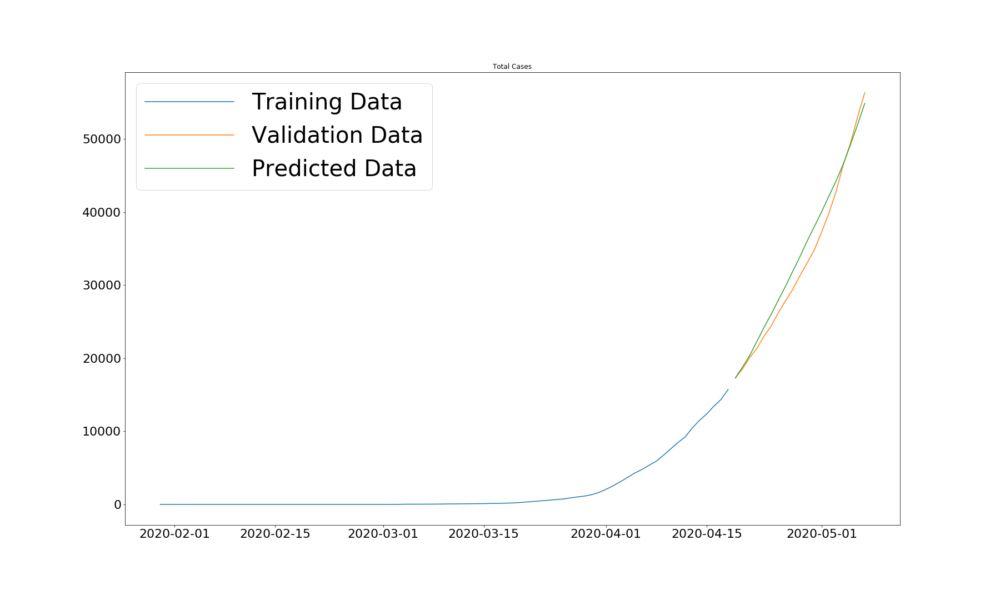
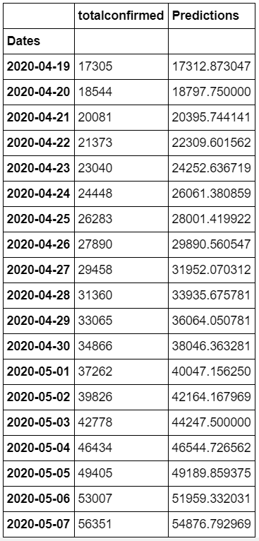

# Pandemic-Forecast
A solution for the COVID-19 pandemic forecast in India.

### Abstract:
  With the rise in the Corona Virus Disease-19 (COVID-19) due to rapid spread of the SARS-CoV2, there is a dire need for government systems to have the ability to optimize the resources that are being put to use against this pandemic. The regions, where outbreaks occur, turn into red zones and most of the government machinary is diverted to provide relief in these red zones. A system for forecasting an epidemic outbreak is necessary to predict the regions most susceptible to outbreaks. We propose the use of deep learning and machine learning techniques to study, analyze and forecast pandemic statistics. Different approaches will be administered over the period alloted and the best methodology will be chosen to build a model which closely predicts the nature of the epidemic curve for the COVID-19. The current dataset consists of the statistics of daily rise in cases, deaths and recoveries for India which starts from January, 30th. We build a model that predicts how the curve will proceed as a function of time and try to optimize it for minimization of error. 
  
### Proposed Solution:
  
 [The dataset](FinalCovid19.csv) consists of the data that has been scraped off the web from websites which provide historical data on COVID-19 statistics. Each column from the dataset is treated as a series which is a function of time. The column of ```Total Confirmed cases``` is used for the initial analysis and the model has been applied over it for demonstration purposes. The algorithm is pretty much generalized and can be applied over any of the column from the dataset. The dataset consists of 99 samples, corresponding to 99 days that India has been fighting the COVID-19 pandemic. These samples are divided in a ratio of 8:2 for training set and testing set respectively.
 
 

Various methods have been used for prediction of time series and the most promising till date has been the usage of RNNs. 
>A Recurrent Neural Network is a class of Artificial Neural Networks where connections between nodes form a directed graph along a temporal sequence. This allows it to exhibit temporal dynamic behavior. Derived from feedforward neural networks, RNNs can use their internal state (memory) to process variable length sequences of inputs. *Source:*[Wikipedia](https://en.wikipedia.org/wiki/Recurrent_neural_network)


Thus, this makes it a perfect candidate for our problem. RNNs use previous time events to inform the later ones. RNNs work well if the problem requires only recent information to perform the present task. If the problem requires long term dependencies, RNN would struggle to model it. The LSTM was designed to learn long term dependencies. It remembers the information for long periods. 
>Long short-term memory (LSTM) is a deep learning system that avoids the vanishing gradient problem. LSTM is normally augmented by recurrent gates called “forget gates”.LSTM prevents backpropagated errors from vanishing or exploding. Instead, errors can flow backwards through unlimited numbers of virtual layers unfolded in space. That is, LSTM can learn tasks that require memories of events that happened thousands or even millions of discrete time steps earlier. Problem-specific LSTM-like topologies can be evolved. LSTM works even given long delays between significant events and can handle signals that mix low and high frequency components. *Source:*[Wikipedia](https://en.wikipedia.org/wiki/Recurrent_neural_network)


Our model uses this LSTM architecture and makess predictions.
To help the LSTM model to converge faster it is important to scale the data. It is possible that large values in the inputs slow down the learning. MinMaxScaling is used to scale the data between 0 to 1. After scaling, the data is transformed into a format that is appropriate for modeling with LSTM. The long sequence of data is transformed into many shorter sequences (4 time bars per sequence) that are targeted to a single output. The LSTM is trained with 30 hidden units. A lower number of units is used so that it is less likely that LSTM would perfectly memorize the sequence. 



Mean Square Error is used as a loss function along with Adam optimizer. The learning rate is set to ```0.001``` and the decay is ```5e-4```. The model is trained over 100 epochs and analyze the results using **Root Mean Squared Error** as a metric. 



As we can observe, it begins to overshoot, but the model converges quickly. The following section summarizes the results for the network.

The training rmse is observed to be ```Training rmse : 0.0115```
The model is then applied to a testing data of 19 samples. The testing rmse is found to be ```Testing rmse : 0.0322494```



As observed, the predictions are quite close to the real time values. The epi curve is largely followed by the network and is pretty accurate. That said, it is unreasonable to expect the network that predicts time series to follow the entire trend of the epicurve upto the turning point. But, having said that, we can see that the network performs quite well at predicting the number of cases per day for the testing set:



## Conclusion
With further data and more analysis resources, we can manage to create a model that may be able to predict the turn around point of the epi curve with a much higher accuracy. The result of this experiment is that the predictions of the model mimic actual values of the sequence, i.e. the number of confirmed cases. Adding another feature, like the number of individuals tested, might help the model predict the cases well before time. But then the model would need to generate two features to use the output of those as an input in next step, which would complicate the model. Using a more complex model (multiple LSTMCells, increase the number of hidden units) might help the model or might harm it. With the current amount of data, we can not accurately predict the impact of such alterations. More advanced methods of teacher forcing might help so that the model would improve sequence generation skills.
